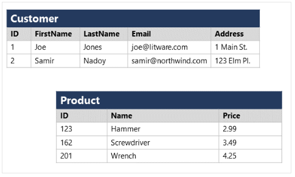
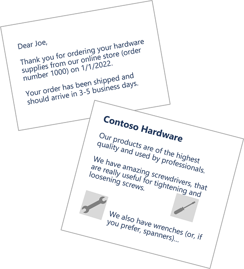
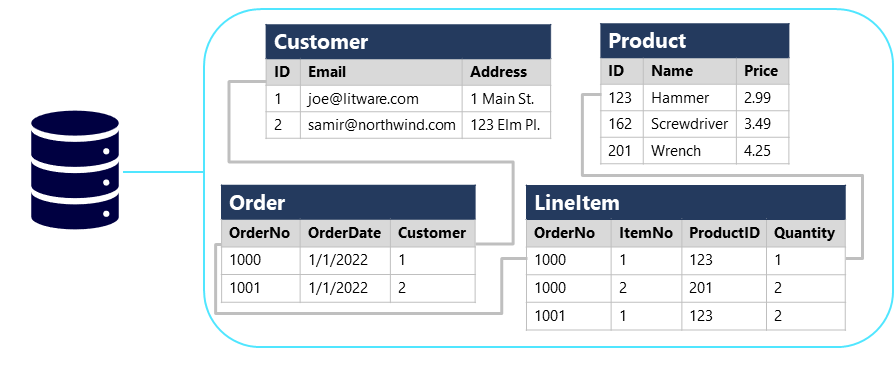
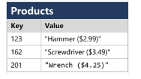
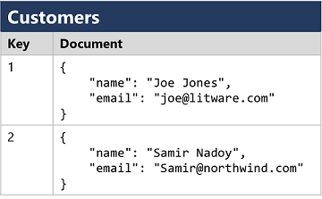
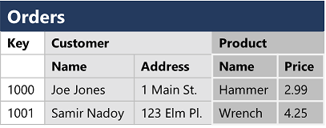
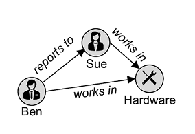
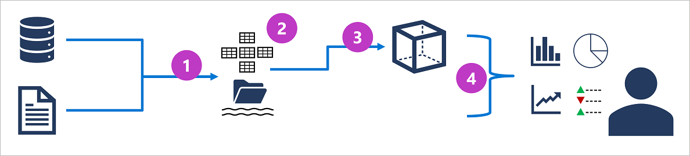

[DP-900 Exam](https://learn.microsoft.com/en-us/credentials/certifications/exams/dp-900/)


# [Explore Data Concepts](https://learn.microsoft.com/en-us/training/paths/azure-data-fundamentals-explore-core-data-concepts/)

## [Identify Data Formats](https://learn.microsoft.com/en-us/training/modules/explore-core-data-concepts/2-data-formats)

* Data - collection of facts such as numbers, descriptions, and observations used to record information. 
* Data structures often represents entities that are important to an organization.
* Each entity has one or more attributes
* Data Classification
    * Structured Data
        * Adheres to a fixed schema, so all the data has the same fields or properties.
        * Most commonly, the schema is tabular
            * Data is represented in one or more tables that consist of     
                * rows to represent each instance of a data entity
                * columns to represent the attributes of the entity
    * Semi-Structured
        * Information that has some structure but allows for some variation between entity instances.
        * Example: while most customers may have an email address, some might have multiple email addresses, ad some might not at all 
        * One common format for semi-structured data is JSON (JavaScript Object Notation)
        * Example shows a pair of JSON docs that represent customer info
    * Unstructured Data
        * Not all data is structured, or even semi-structured. Documents, images, audio, and video data, and binary files might not have a specific structure.
    * Data Stores
        * Organizations typically store data to record details of entities, specific events, or other info in documents, images, and other formats. Stored data can be used for analysis and reporting later.
        * Two broad categories of data store in common use
            * File stores
            * Databases


### Structured Example



### Semi-Structured Example
```json
// SEMI-STRUCTURED

// Customer 1
{
  "firstName": "Joe",
  "lastName": "Jones",
  "address":
  {
    "streetAddress": "1 Main St.",
    "city": "New York",
    "state": "NY",
    "postalCode": "10099"
  },
  "contact":
  [
    {
      "type": "home",
      "number": "555 123-1234"
    },
    {
      "type": "email",
      "address": "joe@litware.com"
    }
  ]
}

// Customer 2
{
  "firstName": "Samir",
  "lastName": "Nadoy",
  "address":
  {
    "streetAddress": "123 Elm Pl.",
    "unit": "500",
    "city": "Seattle",
    "state": "WA",
    "postalCode": "98999"
  },
  "contact":
  [
    {
      "type": "email",
      "address": "samir@northwind.com"
    }
  ]
}
``` 

### Unstructured Data



## [Export File Storage](https://learn.microsoft.com/en-us/training/modules/explore-core-data-concepts/3-file-storage)

* The ability to store data in files is a core element of any computing system.
    * Hard Disk Storage
    * Removable Media
    * Centralized File Storage System (increasingly hosted in the cloud) which offers cost-effective, secure, and reliable storage for large volumes of data.
    * Specific format depends on a number of factors
        * Type of data being stored
        * Applications and services that will need to read, write, and process the data
        * Need for data files to be readable by humans, or optimized for efficient storage and processing.

* Delimited Text Files
    * Plain text format with specific field delimiters and row terminators.
    * Most common format is comma-separated values (CSV). Fields are separated by commas, and rows are terminated by a carriage return/new line.
    * Optionally, the first line may include the field names
    * Other common formats include tab-separated values (TSV) and space-delimited or fixed-width data.
    * Delimited text is a good choice for structured data that needs to be accessed by a wide range of applications and services in a human-readable format.


* JavaScript Object Notation (JSON)
    * Hierarchical document schema used to define data entities that have multiple attributes
    * Flexible that's good for structured/semi-structured data
* Extensible MArkup Language (XML)
    * Human-readable data format popular in 90's-2000s. Superseded by less verbose JSON but there are still some systems that use XML to represent data. 
* Binary Large Object (BLOB)
    * Ultimately all files are stored in binary format.
    * Bytes of binary data are mapped to printable chars (through char encoding scheme like ASCII or Unicode)
    * Some file formats store the data as raw binary that must be interpreted by applications and rendered.
    * Video, Audio, Application-specific documents.
    
* Optimized file formats
    * human-readable formats are not optimized for storage space or processing
    * over time some specialized formats that enable compression, indexing, and efficient storage and processing have been developed
        * Avro
            * Row based format created by Apache
            * Each record contains a header that describes the structure of the record, stored as JSON
            * Application uses the info in the header to parse the binary data
            * Good format for compressing data and minimizing storage and network bandwidth requirements
        * ORC (Optimized Row Columnar format)
            * Organizes data into columns rather than rows
            * Developed by HortonWorks for optimizing read/write operations in Apache Hive
                * Apache Hive is a data warehouse system that supports fast data summarization and querying over large datasets
            * ORC file contains stripes of data. Each stripe holds data for a column or set of columns. Contains an index in the rows of the stripe, the data for each row, and a footer that holds statistical information on each column.
        * Parquet
            * Another columnar format. Created by Cloudera and Twitter. Parquet file contains row groups. Data for each column is stored together in the same row group. 
            * Each row group contains one or more chunks of data. 
            * Parquet file includes metadata that describes the set of rows found in each chunk. Application can use this metadata to quickly locate the correct chunk for a given set of rows and retrieve the data in the specified columns for these rows.
            * Parquet specializes in storing and processing nested data types efficiently.
            * Supports efficient compression and encoding schemes.


### XML Example
```xml
<Customers>
  <Customer name="Joe" lastName="Jones">
    <ContactDetails>
      <Contact type="home" number="555 123-1234"/>
      <Contact type="email" address="joe@litware.com"/>
    </ContactDetails>
  </Customer>
  <Customer name="Samir" lastName="Nadoy">
    <ContactDetails>
      <Contact type="email" address="samir@northwind.com"/>
    </ContactDetails>
  </Customer>
</Customers>
```


### CSV Example
```
FirstName,LastName,Email
Joe,Jones,joe@litware.com
Samir,Nadoy,samir@northwind.com
```


## [Explore Databases](https://learn.microsoft.com/en-us/training/modules/explore-core-data-concepts/4-databases)

* Database is used to define a central system in which data can be stored and queried. 
* In a professional data context, it is a dedicated system for managing data records rather than files.
* Relational Databases
    * Used to store and query structured data. Data is stored in tables that represent entities such as customers, products, or sales orders.
    * Each instance of an entity is assigned a primary key that uniquely identifies it.
    * These keys are used to reference the entity instance in other tables.
    * Customer's primary key can be referenced in a sales order record to indicate which customer placed the order.
    * Use of keys to reference data entities enables a relational database to be normalized
        * elimination of duplicate values so that details of an individual customer are stored only once, not for each sales order the customer places.
    * Tables are managed and queried using Structured Query Language (SQL) which is based on an ANSI standard. 
    * Similar across multiple database systems



* Non-relational databases
    * Data management systems that don't apply a relational schema to the data.
    * Non-relational databases are often referred to as NoSQL database, even though some support a variant of the SQL language.
    * Four common types of Non-Relational database commonly in use
        * Key-Value Database
            * Each record consists of a unique key and associated value which can be in any format
                * 
        * Document Databases
            * Specific form of key-value database in which the value is a JSON document (which the system is optimized to parse and query)
                *   
        * Column family databases
            * Store tabular data compromising of rows and columns, but you can divide the columns into groups known as column-families. Each column family holds a set of columns that are logically related to each other
                * 
        * Graph Databases
            * Store entities as nodes with links to define relationships between them
                * 

## [Explore Transactional Data Processing](https://learn.microsoft.com/en-us/training/modules/explore-core-data-concepts/5-transactional-data-processing)

* Transactional data processing is the primary function of business computing
* Records transactions that encapsulate specific events that the organization wants to track
* Transaction could be financial
  * Movement of money between accounts in banking system
* Transaction could be part of a retail system
  * Tracking payments for goods and services from customers
* Transaction is a small discrete unit of work
* Transactional systems are high-volume, handling millions of transactions in a single day
* Data being processed has to be accessible very quickly
* Work performed by transactional systems is referred to OLTP or Online Transactional Processing.
  * Rely on a database system in which database is optimized for both read/write operations in order to support CRUD
    * Create, Retrieve, Update, Delete
  * OLTP systems are used to support live applications that process business data - often referred to as line of business (LOB) applications.
  * Operations are applied transactionally in a way that ensures the integrity of the data stored in the database
  * To accomplish this, OLTP systems enforce transactions that support ACID semantics
    * Atomicity 
      * Each transaction is a single unit which succeeds or fails completely
      * Transaction involved in debiting funds from one account and crediting the same amount to another account must complete both actions
      * If either action can't be completed, the other action must fail
    * Consistency
      * Transactions can only take data in the database from one valid state to another. 
      * Example: Transfer of funds transaction must reflect the transfer of funds from one account to another.
    * Isolation
      * Concurrent transactions cannot interfere with one another, and must result in a consistent database state.
    * Durability
      * When a transaction has been committed, it will remain committed. After the account transfer transaction has been completed, the revised account balances are persisted so that even if the database system were to be switched off, the committed transaction would be reflected when it is switched on again.

## [Explore Analytical Data Processing](https://learn.microsoft.com/en-us/training/modules/explore-core-data-concepts/6-analytical-processing)

* Uses read-only (or read-mostly) systems that store vast volumes of historical data or business metrics.
* Analytics can be based on a snapshot of the data at a given point in time, or a series of snapshots
* The specific details for an analytical processing system can vary between solutions, but a common architecture foo enterprise-scale analytics looks like the following:



1. Operation data is extracted, transformed, and loaded (ETL) into data lake for analysis
2. Data is loaded into a schema of tables, typically in a Spark-based data alehouse with tabular abstractions, over files in the data lake, or data warehouse with a fully relational SQL engine
3. Data in the data warehouse may be aggregated an loaded into an online analytical processing (OLAP) model, or cube. Aggregated numeric values (measures) from fact tables are calculated for intersections of dimensions from dimension tables. For example, sales revenue might be totaled by date, customer, and product
4. The data in the data lake, data warehouse, and analytical model can be queried to produce reports, visualizations, and dashboards.


* Data lakes are common in large-scale data analytical processing scenarios, where a large volume of ile-based data must be collected and analyzed.
* Data warehouses are an established way to store data in a relational schema tha tis optimized for read operations - primarily queries to support reporting and data visualization. 
Data Lakehouses are a more recent innovation that combine the flexible and scalable storage of a data lake with the relational querying semantic of a data warehouse. The table schema may require some demoralization of dat in an OLTP data source (including some duplication to make queries perform faster).
* An OLAP model is an aggregated type of data storage that is optimized for analytical workloads. Data aggregations are across dimensions at different levels. B y enabling you to drill up/down to view aggregations at multiple hierarchical levels; for example to find total sales by region, by city, or for an individual address. 
* Different types of users might perform data analytical work at different stages of the overall architecture.
  * Data scientists might work directly with data files in a data lake to explore and model data.
  * Data analysts might query tables directly in the data warehouse to produce complex reports and visualizations.
  * Business users might consume pre-aggregated data in an analytical model in the form of reports or dashboards.


### Knowledge Check

1. How is data in a relational table organized?
- Rows and columns

2. Which of the following is an example of unstructured data?
- Audio and Video files

3. What is a Data Warehouse?
- A relational database optimized for read operations.

# [Explore Data Roles and Services](https://learn.microsoft.com/en-us/training/modules/explore-roles-responsibilities-world-of-data/1-introduction)

* Amount of data systems and devices generate has increased significantly
* New tech, roles, and approaches to working with data are affecting data professionals
* Fulfill different roles when managing using and controlling data
* Various roles that organizations often apply to data professionals, tasks and responsibilities associated with these roles, and Azure services used to perform them.

## [Explore Job Roles in the World of Data](https://learn.microsoft.com/en-us/training/modules/explore-roles-responsibilities-world-of-data/2-explore-job-roles)
* Wide variety of roles involved in managing, controlling, and using data. 
* some are business oriented, some engineering, some are research, and some are hybrid roles that combine different aspects of data management.
* Your org may define roles differently or give them different names.
* Different Roles are

* Database Administrator
  * Manage database, assign permissions to users, store backup copies of data, and restore data in the event of failure
  * Responsible for the design, implementation, maintenance, and operational aspects of on-premises and cloud-based database systems. 
  * Responsible for overall availability and consistent performance and optimization of databases
  * Work with stakeholders to implement policies, tools and processes for backup and recovery plans to recover following a natural disaster or human-made error
  * Database administrator is also responsible fo managing the security of the data in the DB, granting privileges, or granting or denying access to users as appropriate.
* Data Engineer
  * Manage infrastructure and process for data integration across the organization, applying data cleaning routines, identifying data governance rules, and implementing pipelines to transfer and transform data between systems.
  * Collaborates with stakeholders to design and implement data-related workloads, including data ingestion pipelines, cleansing and transformation activities, and data stores for analytical workloads.
  * Use a wide range of data platform technologies, including relational and non-relational databases, file store, an data streams.
* Data Analyst
  * Explore and analyze data to create visualizations and charts that enable organizations to make informed decisions.
  * Enables businesses to maximize the value of their data assets. They're responsible for exploring data to identify trends and relationships, designing and building analytical models, and enabling advanced analytics capabilities through reports and visualizations. A data analyst processes raw data into reliant insights based on identified business requirements to deliver relevant insights.


## [Identify Data Services](https://learn.microsoft.com/en-us/training/modules/explore-roles-responsibilities-world-of-data/3-data-services)
* Azure is a cloud platform that powers apps and IT infrastructures.
* Includes services and support to cloud solutions including transactional and analytical data workloads.
* Azure SQL
  * Collective Name for family of relational database solutions based on Microsoft SQL Server db engine.
    * Azure SQL Database - fully managed PaaS database hosted in Azure
    * Azure SQL managed Instance - hosted instance of SQL Server with automated maintenance, which allows more flexible configuration than Azure SQL DB but with more administrative responsibility for the owner
    * Azure SQL VM - virtual machine with an installation of SQL Server, allowing maximum configurability with full management responsibility
    * DBAs provision and manage Azure SQL database systems to support LOB applications that need to store transactional data
    * Data Engineers may use Azure SQL database systems as sources for data pipelines that perform ETL operations to ingest the transactional data into an analytical system
    * Data analysts may query Azure SQL databases directly to create reports. In large orgs, the data is generally combined from data from other sources in an analytical data store to support enterprise analytics.
* Azure Database for open-source relational databases
  * Managed services for open-source database management systems
    * Azure Database for MySQL - commonly used in Linux, Apache, MySQL, and PHP (LAMP) stack apps
    * Azure Database for MariaDB - newer db management system, created by original developers of MySQL. Database engine has been written and optimized to improve performance. MariaDB offers compatibility with Oracle Database (another popular commercial database management system)
    * Azure Database for PostgreSQL-a hybrid relational-object database. You can store data in relational tables, but a PostgreSQL database also enables you to store custom data types, with their own non-relational properties.
    * As with Azure SQL database systems, open-source relational databases are managed by DBAs to support transactional applications, and provide a data source for data engineers building pipelines for analytical solutions and data analysts creating reports.
* Azure Cosmos DB
  * Global-Scale Non-Relational (NoSQL) database system that supports multiple application programming interfaces (APIs), enabling you to store and manage data as JSON documents, key-value pairs, column-families, and graphs
  * Instances can be provisioned and managed by a DBA, but often software developers manage NoSQL data storage as part of the overall application architecture.
  * Data engineers often need to integrate Cosmos DB data sources into enterprise analytical solutions that support modeling and reporting by data analysts.
* Azure Storage
  * Azure Service that enables you to store data in:
    * Blob containers - scalable cost-effective storage for binary files
    * File shares - network file share such as you typically find in corporate networks
    * Tables - key-value storage for applications that need to add read and write data values quickly
    * Data engineers use Azure Storage to host data lakes - which are blob storage with a hierarchical namespace that enables files to be organized in folders in a distributed file system.
* Azure Data Factory
  * An Azure service that enables you to define and schedule data pipelines to transfer and transform data. You can integrate your pipelines with other Azure services, enabling you to ingest data from cloud data stores, process the data using cloud-based compute, and persist the results in another data store.
  * Used by data engineers to build ETL solutions that populate analytical data stores with data from transactional systems across the organization.
* Azure Synapse Analytics
  * PaaS solution for data analytics that provides a single service interface for multiple analytical capabilities, including:
    * Pipelines - based on the same tech as Azure Data Factory
    * SQL - highly scalable SQL database engine, optimized for data warehouse workloads
    * Apache Spark - open-source distributed data processing system that supports multiple programming languages and APIs including Java, Scala, Python, and SQL
    * Azure Synapse Data Explorer -high-performance data analytics solution that is optimized for real-time querying of log and telemetry data using Kusto Query Language (KQL)
  * Data engineers can use Synapse analytics to create a unified data analytics solution that combines data ingestion pipelines, data warehouse storage, and data lake storage through a single service.
  * Data analysts can use SQL and Spark pools through interactive notebooks to explore and analyze data and take advantage of integration with services such as Azure Machine Learning and Microsoft Power BI to create data models and extract insights from the data.
* Azure Databricks
  *  Azure-integrated version of the popular Databricks platform, which combines the Apache Spark data processing platform with SQL database semantics and an integrated management interface to enable large-scale analytics.
  * Data engineers can use existing Databricks and Spark skills to create analytical data stores in Azure Databricks
  * Data Analysts can use the native notebook support in Azure Databricks to query and visualize data in an easy to use web-based interface.
* Azure HDInsight
  * Service that provides Azure-hosted clusters for popular Apache Open-Source Big Data Processing Technologies including:
    * Apache Spark - a distributed data processing system that supports multiple programming languages and APIs, including Java, Scala, Python, and SQL
    * Apache Hadoop - a distributed system that used MapReduce jobs to process large volumes of data efficiently across multiple cluster nodes. MapReduce jobs can be written in Java or abstracted by interfaces such as Apache Hive - a SQL-based API that runs on Hadoop
    * Apache HBase - an open-source system for large-scale NoSQL data storage and querying.
    * Apache Kafka - a message broker for data stream processing
  * Data Engineers can use HDInsight to support big data analytics workloads that depend on multiple open-source technologies.
* Azure Stream Analytics
  *  A real-time stream processing engine that captures a stream of data from an input, applies a query to extract and manipulate data from the input stream, and writes the results to an output for analysis or further processing.
  * Data engineers can incorporate Azure Stream analytics into data analytics architectures that capture steam data for ingestion into an analytical data store or for real-time visualization.
* Azure Data Explorer
  * Standalone service that offers the same high-performance querying of log and telemetry data as the Azure Synapse Data Explorer runtime in Azure Synapse Analytics.
  * Data Analysts can use Azure Data Explorer to query and analyze data that includes a timestamp attribute, such as is typically found in log files and Internet-of-Things (IoT) telemetry data.
* Microsoft Purview
  * Provides a solution for enterprise-wide data governance and discoverability. You can use Microsoft Purview to create a map of your data and track data lineage across multiple data sources and systems, enabling you to find trustworthy data for analysis and reporting.
  * Data engineers can use Microsoft Purview to enforce data governance across the enterprise and ensure the integrity of data used to support analytical workloads.
* Microsoft Fabric
  * Unified SaaS analytics platform based on open and governed lakehouse that includes functionality to support
    * Data ingestion and ETL
    * Data lakehouse analytics
    * Data warehouse analytics
    * Data Science and machine learning
    * Realtime analytics
    * Data visualization
    * Data governance and Management