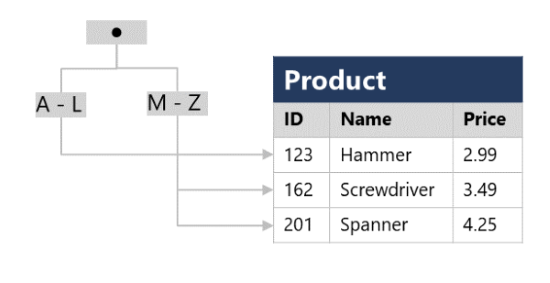
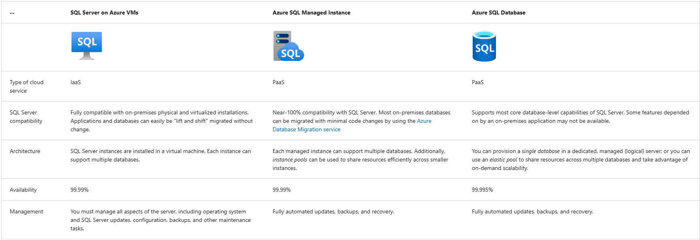
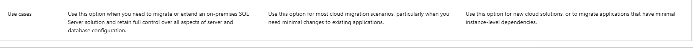

# [Explore Relational Data in Azure](https://learn.microsoft.com/en-us/training/paths/azure-data-fundamentals-explore-relational-data/)

* Relational data is the heart of most business applications
* Foundation of Enterprise Data Solutions
* Services for managing relational databases provided by Azure
* Relational database model was designed to solve the problem of multiple arbitrary data structures
* Provides a standard way of representing and querying data that can be used by any application
* One of the key advantages of relational database model is the use of tables
    * Flexible, intuitive, and efficient way to store and access structured information.
* Simple yet powerful relational model is used by organizations of all types for a borad variety of information management needs.

## [Understand Relational Data](https://learn.microsoft.com/en-us/training/modules/explore-relational-data-offerings/2-understand-relational-data)
* Model collections of entities from the real world as tables
* An entity can be anything for which you want to record information -typically important objects and events
* Tables contain rows, and each row represents a single instance of that entity
* Relational tables are a format for structured data and each row in a table has the same columns; through in some cases, not all columns need to have a value
* Each column stores data of a specific data type
* Available datatypes that you can use when defining a table depend on the system you are using. 
* Standard datatypes are defined by the American National Standards Institute (ANSI)  that are supported by most database systems.

## [Understand Normalization](https://learn.microsoft.com/en-us/training/modules/explore-relational-data-offerings/3-normalization)
* Normalization is a term used by db professionals for a schema design process that minimizes data duplication and enforces data integrity
* While there are many complex rules that define the process of refactoring data into various levels of normalization, a simple definition for practicel purposes is
    * Separate each entity into its own table
    * Separate ach discrete attribute into its own column
    * Uniquely identify each instance (row) using a primary key
    * Use foreign key columns to link tables.

Example:

* Each entity that is represented in the data is stored in its own table, and each discrete attribute of those entities is in its own column
* Recording each instance of an entity as a row in an entity-specific table removes duplication of data.
* For example, to change a customer's address, you need to only modify the value in a single row.
* The decomposition of attributes into individual columns ensures that each value is constrained to an appropriate data type.
* The creation of individual columns provides a useful level of granularity for querying
* Instances of each entity are uniquely identified by an ID oor other key value known as a primary key
* When one entity references another, the primary key of the related entity is stored as a foreign key
* You can look up the address of the customer (which is only stored once) for each record in the Order Table by referencing the corresponding Customer Table
* Relational Database Management System (RDBMS) can enforce referential integrity to ensure that a value entered into a fk field has an existing corresponding primary key.
* In some cases a key can be defined as a composite key, or a unique combination of multiple columns

## [Explore SQL](https://learn.microsoft.com/en-us/training/modules/explore-relational-data-offerings/4-query-with-sql)

* SQL stands for Structured Query Language and is used to communicate with a relational database.
* It's the standard language for relational database management systems. 
* SQL statements are used to perform tasks such as update data in a database or retrieve data from a database.
* Some common relational database management systems that use SQL include Microsoft SQL server, MySQL, PostgreSQL, MariaDB, and Oracle
* SQL was originally standardized by ANSI and ISO. Standard has been extended several times as db vendors have added new features to their systems.
* SQL statements such as SELECT, INSERT, UPDATE, DELETE, CREATE, and DROP
* Many db management system have their own proprietary extensions to handle the specifics
* MS SQL Server and Azure Database services are based on SQL Server db engine that uses Transact-SQL
* PostgreSQL and MySQL have their own versions of these features.
* Popular Dialects
    * Transact-SQL
    * pgSQL - (PostgreSQL)
    * PL/SQL - Oracle. PL/SQL stands for Procedural Language/SQL
* SQL Statement Types
    * Data Definition Language (DDL)
        * Used to create, modify, and remove tables and other object in the database
            * CREATE
            * ALTER
            * DROP
            * RENAME
    * Data Control Language (DCL)
        * manage access to objects in a database by granting, denying or revoking permissions to specific users or objects
            * GRANT
            * DENY
            * REVOKE
    * Data Manipulation Language (DML)
        * used to manipulate the rows in tables.
            * SELECT
            * INSERT
            * UPDATE
            * DELETE

## [Describe Database Objects](https://learn.microsoft.com/en-us/training/modules/explore-relational-data-offerings/5-database-objects)
* Other structures that help to optimize data organization
* Views
    * virtual table based on the results of a SELECT query
* Stored Procedures
    * Defined SQL statementsthat can be run on command. 
* Indexes
    * Helps to search for data in a table
    * Like an index in the back of a book
    * Specify a column from the table, and the index contains a copy of this data in a sorted order, with pointers to the corresponding rows in the table
    * For a table containing few rows, using the indeex is probably not more efficient than reading the entire table and finding rows requested. With tables with a lot of rows, index can dramatically improve the performance of queries.

Example: 

# [Explore Relational Database Services in Azure](https://learn.microsoft.com/en-us/training/modules/explore-provision-deploy-relational-database-offerings-azure/)

* Azure supports multiple db services, enabling  you to run popular relational database management systems such as SQL server, PostgreSQL, and MySQL in the cloud
* Most Azure database services are fully managed, freeing up valuable time you'd otherwise spend managing your db
* Built in Security
* Automatic Monitoring and Threat Detection
* Automatic performance tuning
* Guaranteed Availability

## [Describe Azure SQL services and capabilities](https://learn.microsoft.com/en-us/training/modules/explore-provision-deploy-relational-database-offerings-azure/2-azure-sql)

* Azure SQL is a collective term for a family of MS SQL Server based services in Azure
    * SQL Server on Azure Virtual machines
        * Virtual Machine running in Azure with an installation of SQL Server
        * The use of a VM makes this option an IaaS solution that virtualize  hardware, infrastructure for compute, storage, and networking in Azure.
        * Great option for "lift and shift" migration of existing on-prem SQL Server installations to the cloud.
        * Replicates the db running on an on-premise hardware.
        * Migrating is no different than moving the databases from one on-prem to another
        * Can also use SQL Server on Azure VMs to extend existing on-prem applications to the cloud in hybrid environments
        * Hybrid deployment - system where part of the operation run on-premises, and part in cloud. DB might be part of a larger system that runs on-premises, although db elements might be hosted in the cloud
        * With a virtual machine you have full administrative access over the DBMS and operating system
        * Technical Advantages
            * Can create rapid development and test scenarios when you don't want to buy on-prem non-production SQL Server Hardware
            * Be lift-and-shift ready for existing apps that require a fast migration to the cloud with minimal or no changes
            * Scale up platform on which SQL server is running, by allocating more memory, CPU, and disk space to the virtual machine
            * Resize an Azure VM without the requirement that you reinstall the software that runs on it
        * Business Advantages
            * Allows you to meet unique and diverse business needs
            * Combo of on-prem and cloud-hosted deployments, using the same set of server products, dev tools and expertise 
            * Not always easy to switch DBMS to a fully managed service. May be specific requirements that need to be satisfied in order to migrate a managed service that requires making changes to a database and the applications that use it.
    * Azure SQL Managed Instance 
        * PaaS option that provides 100% compatiibility with on-premSQL server insances
        * Abstracts underlying hardware and OS
        * Service includes automated software update management, backups, and other maintenance tasks
        * Reduces admin burden of supporting a db server instance
        * [What is an Azure SQL Managed Instance](https://learn.microsoft.com/en-us/azure/azure-sql/managed-instance/sql-managed-instance-paas-overview?view=azuresql)
        * Automates backups, software patching, db monitoring, but you have full control over security and resource allocation for databases.
        * Depends on other Azure services such as Azure Storage for backups, Azure Event Hubs for telemetry, Entra ID for Auth, Azure Key Vault for TDE and a few Azure Platform Instances. Managed instnaces can connect to these services.
        * All communications are encrypted and signed using certs. 
        * Use Cases
            * Lift-And-Shift on-prem and SQL Server instance  to the cloud without incurring Management Overhead
            * Features not available in SQL database. If your system uses Linked Servers, Service Broker, DB Mail you should use Managed Instance.
            * Data Migration Assistant available to check compatibility with an existing on-premises system.
        * Business Benefits
            * System admin to spend less time on administrative tasks
            * Automated tasks include os system and database management system software installation and patching, dynamic instance resizing, and configuration, backups, and database replication.
            * Azure SQL Managed Instance supports SQL Server Database engine logins and logins integrated with Microsoft Entra ID.
    * Azure SQL DB
        * Fully managed, highly scalable PaaS database service that is designed for the cloud
        * Core database-level capabilities of on-prem server and is a good option when you need to create a new application in the cloud
        * Azure SQL Database Server is a logical construct that acts as a central administrative point for multiple single or pooled databases, logins, firewall rules, auditing rules, threat detection policies, and failover groups.
        * Azure SQL database is available as a Single Database or an Elastic Pool
            * Single Database
                * Create and run a db server in the cloud, and you access your db through this server
                * Microsoft manages the server, so all you have to do is configure the db, create your tables, and populate them with your data.
                * You can scale hte db if you need more storage space, memory, or processing power.
                * Resources are pre-allocated. You're charged per-hour for the resources you've requested.
                * You can also specify a serverless configuration. Microsoft creates its own server, which might be shared by databases belonging to the other Azure Subscribers.
                * Microsoft ensures the privacy of your database. Your db automatically scales and resources allocated or de-allocated as required.
            * Elastic Pool
                * Similar to Single Database, except that by default multiple databases can share the same resources such as memory, data storage space, and power through multiple-tenancy
                * Resources are referred to as a pool. You create the pool, and only your databases can use the pool. 
                * You create the pool, and only your database can use the pool.
                * This model is useful if you have databases with resource requirements that vary over time, and can help you to reduce costs.
                * For example, your payroll database might require plenty of CPU power at the end of the month, but at other times the db might become less active. You might have another DB that is used for running reports, but it might become active for several days in the middle of the month but with a lighter load at other times.
                * Elastic pool enables  you to use the resources available in the pool, and then release the resources once processing has completed.
            * Use Cases
                * Gives you the best option for low cost with minimal administration. 
                * Isn't fully compatible with on-prem SQL Server installations. 
                * Often used in new Cloud Projects where the application design can accommodate any required changes to applications
                * Can use DM assistant to detect compatibility issues with databases that can impact database functionality in Azure SQL Database.
                * [Data Migration Assistant](https://learn.microsoft.com/en-us/sql/dma/dma-overview?view=sql-server-ver16)
                * Often Used for
                    * Modern Cloud Applications that need to use the latest stable SQL Server Features
                    * Applications that require high availability
                    * Systems with a variable load that need the DB server to scale up and down quickly
            * Business Benefits
                * Azure SQL DB automatically updates and patches the SQL Server Software to ensure that you're always running on the latest and most secure version of the service
                * Scalability features of Azure SQL Database ensure tht you can increase the resources available to store and process data without having to perform a costly manual upgrade
                * High availability guarantees
                * Point in Time Restore
                * Replication to different regions
                * Advanced Threat protection
                * Auditing of DB events
                * Providing encryption at rest and in motion
    * Azure SQL Edge
        * SQL engine that is optimized for IoT scenarios that need to work with streaming time-series data   

## [Describe Azure services for open-source databases](https://learn.microsoft.com/en-us/training/modules/explore-provision-deploy-relational-database-offerings-azure/3-azure-database-open-source)
- Azure data services are available for other popular relational database systems, including MySQL, MariaDB, and PostgreSQL. 
- Primary reason for these services is to enable orgs that use them in on-premises apps to move to Azure quickly without making significant changes to their applications.
- MySQL, MariaDB, and PostgreSQL are relational database management systems that are tailored for different specifications
- MySQL - open-source db management system. Leading open source relational database for Linux, Apache, MySQL, and PHP (LAMP) Stack apps
    - Avail in Community, Standard, and Enterprise
- MariaDB is a newer DB Management system created by original developers of MySQL
    - DB has been rewritten and optimized to improve performance
    - Offers compatibility with Oracle Database 
    - Built in support for temporal data
    - Table can hold several versions of data, enabling an application to query the data as it has appeared at some point in the past
- PostgreSQL is a hybrid relational-object db. 
    - Can store relational data in tables, but also enables you to store custom data types with their own non-relational properties
    - Extensible, you can add core modules to the db which can be run by queries. 
    - Ability to store and manipulate geometric data, such as lines, circles, and polygons.
    - PgSQL is the query language. Variant of the standard SQL, with features that enable you to write stored procedures that run inside the db.

## [Explore Azure Relational Database Services]()

