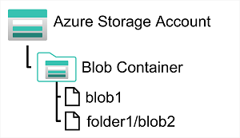
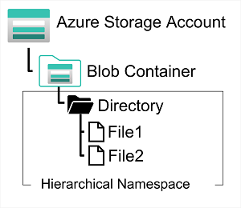
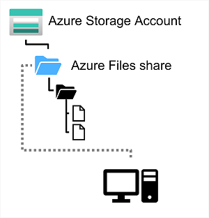

## [Intro](https://learn.microsoft.com/en-us/training/modules/explore-provision-deploy-non-relational-data-services-azure/1-introduction)

- Many applications don't need the rigid structure of a relational database and rely on non-relational (NoSQL) storage
- Azure Storage is one of the core services in Azure and offers a range of options for storing data in the cloud
- In this module you explore the fundamental capabilities of Azure storage and learn how it's used to support applications that require non-relational data stores.

## [Azure Blob Storage](https://learn.microsoft.com/en-us/training/modules/explore-provision-deploy-non-relational-data-services-azure/2-azure-blob-storage)
- Service that enables you to store massive amounts of unstructured data
- Binary objects (blobs) are an efficient way to store data files in a format that is optimized for cloud-based storage, and apps
- Containers - convenient way of grouping related blobs together. 
    - You control who can read and write blobs inside a container at the container level
- You can organize blobs in a hierarchy of virtual folders, similar to files in a file system on disk
    - Folders are simply a way of using a "/" char in a blob name to organize the blobs into namespaces
    - Folders are purely virtual, can't perform folder-level operations to control access or perform bulk operations

- Three different types of blobs
    - Block blobs 
        - Handled as a set of blocks. Each block can vary in size, up to 4000 MiB.
        - Can contain up to 190.7 TiB (4000 MiB X 50,000 blocks), giving a maximum size of over 5000 MiB
        - The block is the smallest amount of data that can be written or read as an individual unit
        - Block blobs are best used to store discrete, large, binary objects that change infrequently
    - Page blobs
        - Organized as a collection of fixed size 512-byte pages. Optimized to support random read/write operations
        - You can fetch more data for a single page if necessary
        - Used to implement virtual disk storage for virutal machines
        - Page blob can hold up to 8 TB of data.
    - Append blobs
        - An append blob is a block blob optimized to support append operations.
        - You can only add blocks to the end of an append blob; 
        - Updating and deleting blocks isn't supported
        - Each block can vary in size, up to 4 MB
        - Max size is 195GB

- Three access tiers to help balance latency and storage cost
    - Hot tier
        - default
        - used for blobs that are accessed frequently
        - Stored on high-performance media
    - Cool tier
        - Low performance, incurs reduced storage charges
        - Data that is accessed infrequently
        - Common for newly created blobs to be accessed frequently, but less as time passes.
        - May want to migrate the blob to the cool tier later
    - Archive tier
        - Low storage, and increased latency
        - Intended for historical data that shouldn't be lost, but is required rarely
        - Typical reading latency is a few milliseconds
        - Must change access to hot or cool to read, blob will then be rehydrated
    
- You can create lifecycle management policies for blobs in a storage account. 
- Lifecycle management policy can automatically move a blob from Hot to Coo, then to Archive as it is used less frequently
- Lifecycle management policy can also arrange to delete outdated blobs.

## [Azure DataLake Storage Gen2](https://learn.microsoft.com/en-us/training/modules/explore-provision-deploy-non-relational-data-services-azure/3-azure-data-lake-gen2)

- Azure Data Lake Storage (Gen 1) is a separate service for hierarchical data storage for analytical data lakes, used by big data analytical solutions that work with structured, semi-structured, and unstructured data stored in files.
- Azure Data Lake Storage (Gen 2) is a newer version that is integrated into Azure Storage; enabling you to take advantage of the scalability of blob strogage and cost-control storage tiers, combined with the hierarchical system capabilities and compatibility with major analytics systems of Azure Data Lake Store

- Hadoop, Azure HDInsight, Azure Databricks, and Azure Synapse Analytics can mount a distributed file system hosted in Azure Data Lake Store Gen2 and use it to produce huge volumes of data
- To create you must enable Hierarchical Namespace option of Azure Storage Account.
- Upgrading is a one-way process.

## [Explore Azure Files](https://learn.microsoft.com/en-us/training/modules/explore-provision-deploy-non-relational-data-services-azure/4-azure-files)

- Many On-Prem systems comprising a network of in-house computers make use of file shares
- Allows you to store a file on one computer, and grant access to that file to users and apps running on other computers
- Doesn't scale well as the number of users increases, or if the users are located at different sites
- Azure Files is a way to create a cloud-based network share, like you would typically have in on-prem organizations.
- By hosting file shares in Azure, organizations can eliminate hardware costs, and maintenance overhead
- High availability and Scalability

- You create Azure File storage in a storage account
- Can share up to 100 TB of data in a single account
- Data can be distributed across any number of file shares. 
- Supports 2000 concurrent connections per shared file
- Can upload files using Azure Portal or AzCopy utility
- Can use file sync to synchronize locally cached copies of shared files
- Two performance tiers
    - Standard - hard disk-based hardware
    - Premium- solid-state disks. Greater throughput but higher rate
- Two common network share protocols
    - Server Message Block (SMB) is commonly used across multiple operating systems
    - Network File System (NFS) used by some Linux and macOS versions

## [Explore Azure Tables](https://learn.microsoft.com/en-us/training/modules/explore-provision-deploy-non-relational-data-services-azure/5-azure-tables)
- NoSQL storage solution that makes use of tables containing key/value data items. Each item is represented by a row that contains columns for data fields that needs to be stored
- Not like a relational database. Allows you to store semi-structured data
- All rows must have a unique key comprised of a partition key and a row key
- When you modify data in a table, a timestamp records the date and time the modification was made
- The columns in the row can vary. 
- No concept of foreign keys, relationships, stored procs, views or other objects in relational db
- Data in Azure Table storage is usually denormalized, each row holds entire data for a logical entity
- For example
    - A table holding customer info might store first, last, phones, or addresses
    - Number of fields can be different depending on the number of telephone numbers and addresses for each customer. Details recorded for each address
    - In relational database this info would split across multiple rows in several tables
- For fast access Azure Table Storage splits a table into partitions
- Partitions are a mechanism for grouping related rows, based on a common property or partition key.
- Rows that share the same partition key will be stored together
- Partitioning not only helps organize the data, it can improve scalability and performance in the following ways
    - Independent from each other, and can grow and shrink as rows are added to or removed from a partition.
        - A table can contain any number of partitions
    - Searching data can include the partition key in the search criteria. Helps to narrow the volume of data to be examined.
        - Improves performance by reducing the amount of I/O needed to locate the data
- The key in an Azure Table Storage comprises of two elements:
    - Partition key that identifies the partition containing the row
    - Row key that is unique to each row in the partition
- Items in the same partition are stored in row key order
- If an app adds a new row to the table, Azure ensures that the row is placed in the correct position in the table
- Scheme enables an app to quickly perform point queries that identify a single row, and range queries that fetch a contiguous block of rows in a partition

## [Explore Azure Storage](https://learn.microsoft.com/en-us/training/modules/explore-provision-deploy-non-relational-data-services-azure/6-exercise-azure-storage)
- Provision Azure Storage Account
- Explore Blob Storage
- Explore Data Lake Storage Gen2
- Explore Azure Files
- Explore Azure Tables