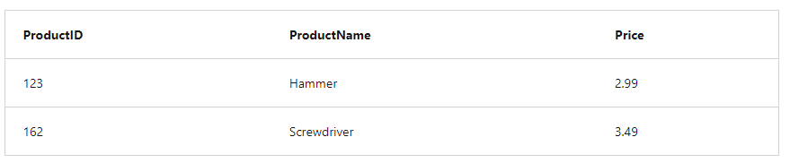
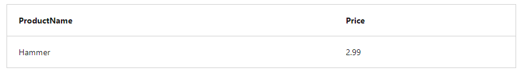
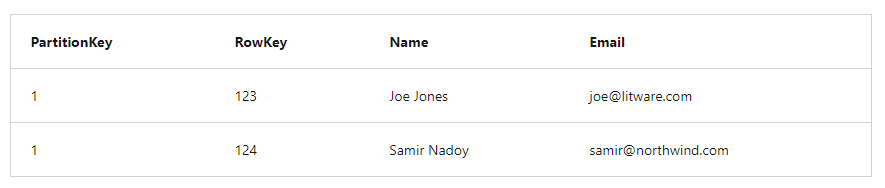
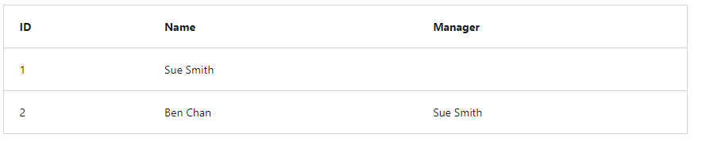
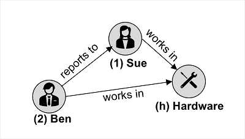

## [Intro](https://learn.microsoft.com/en-us/training/modules/explore-non-relational-data-stores-azure/1-introduction)
- Relational dbs store data in relational tables, but sometimes the structure can be too rigid and leads to poor performance unless you spend time implemented detailed tuning
- Other models like NoSQL databases exist. These models store data in other structures such as docs, graphs, key-value stores, and column family stores
- Azure cosmos DB is a highly scalable cloud service for NoSQL data

## [Describe Azure Cosmos DB](https://learn.microsoft.com/en-us/training/modules/explore-non-relational-data-stores-azure/2-describe-azure-cosmos-db)
- Supports multiple APIs that enable developers to use the programming semantics of common data stores to work with data in a Cosmos DB database
- Internal data structure is abstracted, enabling developers to use Cosmos DB to store and query data using APIs with which they're already familiar
- API 
    - Application Programming Interface
    - DB management systems (and other software frameworks) provide a set of APIs that devs can use to write programs that need to access data
    - APIs vary for different database management systems
- Cosmos DB uses indexes and partitioning to provide fast read and write performance and can scale to massive volumes of data. 
- You can enable multi-region writes, adding the Azure regions of your choice to your Cosmos DB account so that globally distributed users can each work with their data in local replica
- When to use
    - Highly scalable
    - Automatically allocates space in a container for partitions
    - Each partition can grow to 10GB ins ize
    - Indexes are created and maintained automatically
    - Virtually no administrative overhead
- Foundational service in Azure, Cosmos DB has bee used by many of microsoft's products for mission critical apps
- Highly suitable for the following
    - IoT and telematics
        - Large amounts of data in frequent bursts of activity
        - Can accept and store info quickly
        - Data can be used by analytics services, such as Azure Machine Learning, Azure HDInsight, and PowerBI
        - Can also process data in real-time using Azure Functions that are triggered as data arrives in the database
    - Retail and Marketing
        - Used by microsoft for E-Commerce platforms that run as part of Windows and Xbox Live
        - Also used in retail industry for storing catalog data and for event sourcing in order processing pipelines
    - Gaming
        - DB tier is a crucial component of gaming applications
        - Modern games perform graphical processing on mobile/console clients, but rely on the cloud to deliver customized and personalized content like in-game stats, social media integration, high-score leaderboards.
        - Often require single-millisecond latencies for reads and write to provide an engaging in-game experience.
        - Needs to be fast and able to handle massive spikes in request rates during new game launches and feature updates
    - Web and Mobile Apps
        - Well suited for modeling social interactions
        - Integrating with third party services
        - Xamarin framework 


## [Identify Azure Cosmos DB APIs](https://learn.microsoft.com/en-us/training/modules/explore-non-relational-data-stores-azure/3-cosmos-db-apis)
- Fully managed and serverless distributed database for applications of any size eor scale
- Can build and migrate applications with their preferred open source db engines.
- When you provision a new Cosmos DB instance, you select the db engine that you want to use

### Azure Cosmos DB for No SQL
- Microsoft's native non-relational service for working with the document data model
- Despite NoSQL data storage, uses SQL syntax to work with the data

```sql
SELECT *
FROM customers c
WHERE c.id = "joe@litware.com"
```

The result is as follows:

```json
{
   "id": "joe@litware.com",
   "name": "Joe Jones",
   "address": {
        "street": "1 Main St.",
        "city": "Seattle"
    }
}
```

### Azure Cosmos for MongoDB
- Mongo is a popular open source db in which data is stored in Binary JSON (BJSON) format. 
- Cosmos for Mongo DB enables devs to use mongoDB client libraries and code to work with data in Azure Cosmos db
- MongoDB Query Language uses object-oriented syntax in which developers use objects to call methods.

```js
db.products.find({id: 123})
```

Results as follows:

```json
{
   "id": 123,
   "name": "Hammer",
   "price": 2.99
}
```

### Azure Cosmos DB for PostgreSQL
- Globally distributed db that shards data to help build scalable apps
- Build apps on a single node server group
- As your apps scalability and performance requirements grow, you can seamlessly scale to multiple nodes by distributing your tables
- PostgreSQL is a relational database management system (RBDMS) in which you define relational tables of data.



Table can be queried as follows

```sql
SELECT ProductName, Price 
FROM Products
WHERE ProductID = 123;
```

And would result in the following




### Azure Cosmos DB for Table
- Used to work with data in key-values tables similar to Azure Table Storage
- Offers greater scalability and performance than Azure Table Storage
- You might define a table named customers as follows



And then use the Table API using one of the language-specific SDKs to make calls to endpoint to retrieve data from the table.

```
https://endpoint/Customers(PartitionKey='1',RowKey='124')
```

### Azure Cosmos DB for Apache Cassandra
- Cosmos DB for Apache Cassandra is compatible with Apache Cassandra, popular open source db that use a column-family storage structure
- Column families are tables where it's not mandatory for every row to have the same column

For Example, you might have an employees table like below




- Cassandra supports a syntax based on SQL so a client application can retrieve the record like below

```sql
SELECT * FROM Employees WHERE ID = 2
```


### Azure Cosmos DB for Apache Gremlin
- Used with Data in Graph Structure
- Entities are defined as vertices that form nodes in connected graph
- Nodes are connected by edges that represent relationships



- Two types of vertex (employee and department) and edges that connect them
- Gremlin syntax includes functions to operate on vertices and edges, enabling you to insert, update, delete, and query data in the graph
- For example you could use the code to add a new employee that reports to the employee with ID 1

```
g.addV('employee').property('id', '3').property('firstName', 'Alice')
g.V('3').addE('reports to').to(g.V('1'))
```

The following returns all of the employee vertices in order of ID

```
g.V().hasLabel('employee').order().by('id')
```

## [Explore Azure Cosmos DB](https://learn.microsoft.com/en-us/training/modules/explore-non-relational-data-stores-azure/4-exercise-explore-cosmos-db)
- Create Cosmos DB Account
- Create a Sample DB
- View and CReate Items
- Query the DB
