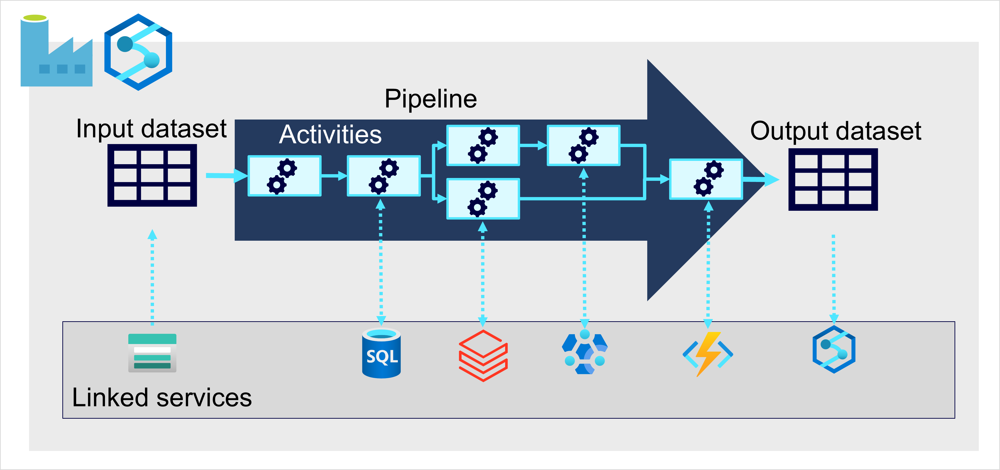

## [Introduction](https://learn.microsoft.com/en-us/training/modules/examine-components-of-modern-data-warehouse/1-introduction)
- Large-Scale Data Analytics solutions combine conventional data warehousing and data lakehouse techniques to integrate data from files and external sources
- A conventional data warehouse solution typically involves copying data from transactional data stores into a relational db with a schema that's optimized for queryigna nd building multidimensional models
- Data lakehouse solutions on the other hand, are used with large volumes of data in multiple formats, which is batch loaded or captured in real-time streams and stored in a data lake from which distributed processing engines like Apache Spark are used to process it.

## [Describe Data Warehousing Architecture](https://learn.microsoft.com/en-us/training/modules/examine-components-of-modern-data-warehouse/2-describe-warehousing)
- Large-scale data analytics architecture can vary, as the specific technologies used to implement
- In General the following are included

1. Data Ingestion and processing
    - Data from one or more transactional stores, files, or real-time streams, or other sources is loaded into data lake or a relational data warehouse
    - Load operation involves and extract, transform, and load (ETL) or extract, load, transform (ELT) process where the data is cleaned, filtered, and restructured for analysis
    - In ETL processes, the data is transformed before being loaded into an analytical stor
    - In ELT processes, the data is copied into the store, then transformed
    - Either way the result is a structure that is optimized for analytical queries
    - Data processing is often performed by distributed systems that can process high volumes of data in parallel using multi-node clusters
    - Data ingestion includes both batch processing of static data and real-time processing of streaming data

2. Analytical data store
- Data stores for large scale applications include 
    - Relational Data Warehouses
    - File-system based data lakes
    - Hybrid architectures
- Combine features of data warehouses and data likes
- Sometimes called data lakehouses or lake databases

3. Analytical data model
    - In analytical data store its common to create one or more data models that pre-aggregate the data to make it easier to produce reports, dashboards, and interactive visualizations
    - Often data models are described as cubes
    - Numeric values are aggregated across one or more dimensions (for example to determine total sales by product and region)
    - Model encapsulates relationships between data values and dimensional entities to support "drill up/down" analytics

4. Data Visualization
    - Consume data from Analytical models and directly from analytical stores to create reports, dashboards and other visualizations
    - Users who may not be tech professionals might perform self-service data analysis and reporting
    - Visualizations from the data show trends, comparisons, and KPIs and can take the form of reports, graphs, and charts

## [Explore Data Ingestion Pipelines](https://learn.microsoft.com/en-us/training/modules/examine-components-of-modern-data-warehouse/3-data-ingestion-pipelines)
- How Data is ingested into an analytical data store from one or more sources

- Large scale ingestion is best implemented by creating pipelines that orchestrate ETL processes
- You can create and run pipelines using Azure Data Factory
- Use similar pipeline engine in Azure Synapse Analytics or Microsoft Fabric if you want to manage all of the components of data analytics solution in a unified workspace
- Pipelines consist of one or more activities that operate on data
- Input dataset provides the source data 
- Activities are the flow of data that incrementally manipulates the data until an output dataset is produced
- Pipelines can connect to external data sources to integrate with a wide variety of data services.

## [Analytical Data Stores](https://learn.microsoft.com/en-us/training/modules/examine-components-of-modern-data-warehouse/4-analytical-data-stores)

- Two common types of analytical data store
    - Data Warehouse
        - Relational database in which the data is stored in a schema that is optimized for data analytics rather than transactional workloads
        - Commonly the data is transformed into a schema in which numeric values are stored in central fact tables, which are related to one or more dimension tables
        - Represent entities by which the data can be aggregated
        - Fact table might contain sales order data, which can be aggregated by customer, products, store, and time dimensions
                - Easily find monthly totals sales revenue by product for each store
                - Star Schema (Often extended into a snowflake schema by adding additional tables related to the dimension tables)
                    - Example, product might be related to Product Categories
        - Data Warehouse is a great choice when you have transactional data that can be organized into a structured schema of tables, and you want to use SQL to query them
    - Data Lakehouse
        - Distributed file system for high performance data access
        - Spark or Hadoop are used to process queries on stored files and return data for reporting and analytics
        - Schema-on-read approach to define tabular schemas on semi-structured data files at the point where the data is read for analysis without applying constraints when its stored
        - Great for supporting a mix of structured, semi-structured, and unstructured data without need for schema enforcement when data is written to the store
- Hybrid approach combines data lakes and data warehouses into data lakehouse or lakebase. 
    - Raw data is stored as file and relational storage layer abstracts the underlying files and exposes them as tables.
    - Can be queried using SQL
    - SQL pools in Azure Synapse analytics include Polybase - enables you to define external tables based on files in a data lake (and other sources) and query them using SQL
    - Synapse analytics also supports a Lake database approach in which you can use database templates to define the relational schema of your warehouse, while storing the underlying data in lake storage, separating the storage and compute for your data warehousing solution.
    - Relatively new approach in Spark-based systems, and are enabled through technologies like Delta Lake, which adds relational storage capabilities to Spark
        - Define Tables that enforce schemas and transactional consistency
        - Support batch-loaded and streaming data sources
        - Provide a SQL for API querying

## [Explore PaaS Solutions](https://learn.microsoft.com/en-us/training/modules/examine-components-of-modern-data-warehouse/4b-platform-services)
- 

## [Explore Data Analytics in Azure with Azure Synapse Analytics]()

## [Explore Microsoft Fabric]()