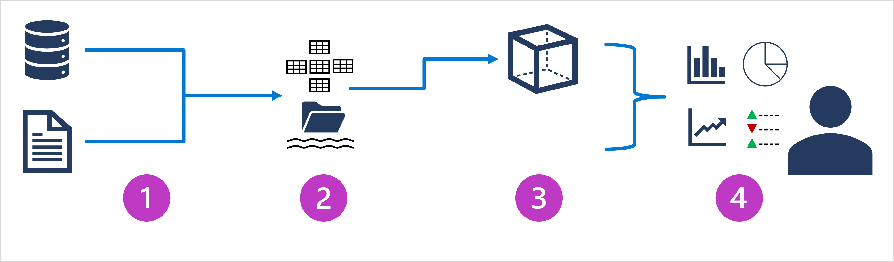

## [Introduction](https://learn.microsoft.com/en-us/training/modules/examine-components-of-modern-data-warehouse/1-introduction)
- Large-Scale Data Analytics solutions combine conventional data warehousing and data lakehouse techniques to integrate data from files and external sources
- A conventional data warehouse solution typically involves copying data from transactional data stores into a relational db with a schema that's optimized for queryigna nd building multidimensional models
- Data lakehouse solutions on the other hand, are used with large volumes of data in multiple formats, which is batch loaded or captured in real-time streams and stored in a data lake from which distributed processing engines like Apache Spark are used to process it.

## [Describe Data Warehousing Architecture](https://learn.microsoft.com/en-us/training/modules/examine-components-of-modern-data-warehouse/2-describe-warehousing)
- Large-scale data analytics architecture can vary, as the specific technologies used to implement
- In General the following are included

1. Data Ingestion and processing
    - Data from one or more transactional stores, files, or real-time streams, or other sources is loaded into data lake or a relational data warehouse
    - Load operation involves and extract, transform, and load (ETL) or extract, load, transform (ELT) process where the data is cleaned, filtered, and restructured for analysis
    - In ETL processes, the data is transformed before being loaded into an analytical stor
    - In ELT processes, the data is copied into the store, then transformed
    - Either way the result is a structure that is optimized for analytical queries
    - Data processing is often performed by distributed systems that can process high volumes of data in parallel using multi-node clusters
    - Data ingestion includes both batch processing of static data and real-time processing of streaming data

2. Analytical data store
- Data stores for large scale applications include 
    - Relational Data Warehouses
    - File-system based data lakes
    - Hybrid architectures
- Combine features of data warehouses and data likes
- Sometimes called data lakehouses or lake databases

3. Analytical data model
    - In analytical data store its common to create one or more data models that pre-aggregate the data to make it easier to produce reports, dashboards, and interactive visualizations
    - Often data models are described as cubes
    - Numeric values are aggregated across one or more dimensions (for example to determine total sales by product and region)
    - Model encapsulates relationships between data values and dimensional entities to support "drill up/down" analytics

4. Data Visualization
    - Consume data from Analytical models and directly from analytical stores to create reports, dashboards and other visualizations
    - Users who may not be tech professionals might perform self-service data analysis and reporting
    - Visualizations from the data show trends, comparisons, and KPIs and can take the form of reports, graphs, and charts

## [Explore Data Ingestion Pipelines]()

## [Explore PaaS Solutions]()

## [Explore Data Analytics in Azure with Azure Synapse Analytics]()

## [Explore Microsoft Fabric]()