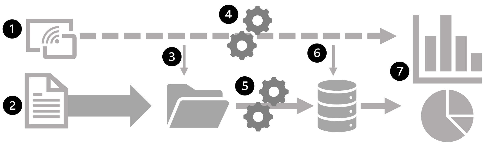
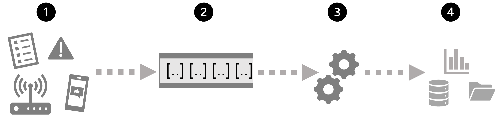
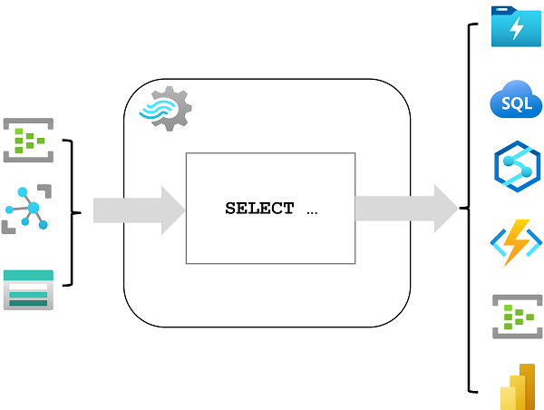
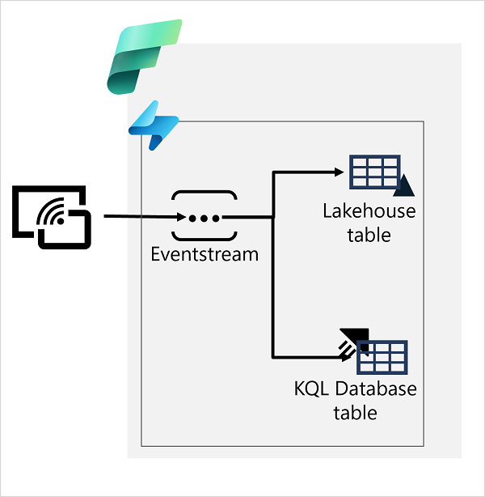

## [Intro](https://learn.microsoft.com/en-us/training/modules/explore-fundamentals-stream-processing/1-introduction)
- Growth in volume of data that can be generated, captured, and analyzed
- Data can be processed in real-time or near real-time as a perpetual stream of data
- Creation of systems that reveal instant insights and trends or take immediate responsive action to events as they occur

## [Understand Batch and Stream Processing](https://learn.microsoft.com/en-us/training/modules/explore-fundamentals-stream-processing/2-batch-stream)
- Two general ways to process data
    - Batch Processing
        - Data is collected and stored before being processed together
        - Newly arriving data elements are collected and stored
        - The whole group is processed together as a batch
        - Advantage
            - Large volumes of data can be processed at a convenient time
            - It can be scheduled to run at a time when computers or systems might be otherwise idle, such as overnight or during off-peak hours
        - Disadvantage
            - Time delay when ingesting data
            - All input data must be ready before being processed
    - Stream 
        - Source of data is constantly monitored and processed in real time as new data events occur
        - Each piece of new data is processed whe it arrives
        - No waiting until the next batch processing interval
        - Beneficial in scenarios where new dynamic data is generated on a continual basis
    - Real world examples
        - Track stock market changes in real time
        - Online gaming company collects real-time player game interactions
        - Real-estate site that tracks a subset of data from mobile devices, and makes real-time property recommendations of properties to visit based on geo-location
    - Differences between batch and streaming data
        - Data scope
            - Can process all the data in the dataset via batch processing
            - Stream processing only has access to the most recent data received or withing a rolling time window.
        - Data Size
            - Batch Processing is suitable for handling large datasets efficiently
            - Stream processing is intended for individual record or micro batches consisting of few records
        - Performance
            - Latency is time taken for the data to be received and processed. 
            - Typically for batch processing is a few hours
            - Stream processing typically occurs immediately, with latency in the order of seconds or milliseconds
        - Analysis
            - You typically use batch processing to perform complex analytics
            - Stream processing is used for simpler response functions, aggregates, or calculations such as rolling averages
    - Combine batch and stream processing
        - Common for stream processing solutions to capture real-time data, process it by filtering or aggregating it, and present it through real-time dashboards and visualizations.

1. Data events from streaming source are captured in real time
2. Data from other sources is ingested into data store for batch processing
3. If real-time analytics is not required, the captured streaming data is written to the data store for subsequent batch processing
4. When real-time analytics is required, a stream processing technology is used to prepare streaming data for real-time analytics or visualization, by filtering or aggregating data over temporal windows
5. Non-streaming data is periodically batch processed to prepare it for analytics and the results are persisted in an analytical data store (referred to as a data warehouse) for historical analysis
6. Results may also be persisted in the analytical data store to support historical analytics
7. Analytical and visualization tools are used to present and explore the real-time and historical data.

- Commonly used architectures include lambda and delta architectures
- Incorporate technologies for both large-scale batch data processing and real-time stream processing to create an end-to-end data analytical solution

## [Explore Common Elements of Stream Processing Architecture](https://learn.microsoft.com/en-us/training/modules/explore-fundamentals-stream-processing/3-explore-common-elements)
- Many technologies that you can use to implement a stream processing solution
- Common elements

1. Event that generates some data
2. Generated data is captured in a streaming source for processing
3. Event data is processed by a perpetual query that operates on the event data to select data for specific types of events, project data values or aggregated data over temporal (time-based) periods (or windows).
4. Results of stream processing are written to an output (or sink)

Real-time analytics in Azure
- Azure Stream Analytics
    - PaaS solution that you can use to define streaming jobs that ingest data from a streaming source, apply a perpetual query, and write the results to an output
- Spark Structured Streaming
    - Open-Source library that enables you to develop complex streaming solutions on Apache Spark based services, including Azure Synapse Analytics, Azure Databricks, and Azure HDInsight
- Azure Data Explorer
    - High-performance database and analytics service that is optimized for ingesting and querying batch or streaming data with a time-series element, and which can be used as a standalone Azure service or as ana Azure Synapse Data Explorer runtime in an Azure Synapse Analytics workspace

Sources for stream processing
- Azure Event Hubs
    - Data ingestion service that you can use to manage queues of event data, ensuring that each event is processed in order exactly once
- Azure IoT Hub
    - Data ingestion service is similar to Azure Event Hubs but is optimized for managing event data from IoT devices
- Azure Data Lake Storage Gen 2
    - Storage Service used for batch processing scenarios, but can also be used for source of streaming data
- Apache Kafka
    - Open source data ingestion solution that is commonly used together with Apache Spark
    - You can use Azure HDInsight to create a Kafka cluster

Sinks for stream processing
- Output from stream processing is sent to the following services
    - Azure Event Hubs 
        - Used to queue the processed data for further downstream processing
    - Azure Data Lake Store Gen 2 or Azure Blob Storage
        - Used to persist the processed results as a file
    - Azure SQL Database or Azure Synapse Analytics or Azure Databricks
        - Used to persist the processed results in a db table for querying and analysis
    - Microsoft Power BI
        - Used to generate real time data visualizations in reports and dashboards

## [Explore Azure Stream Analytics](https://learn.microsoft.com/en-us/training/modules/explore-fundamentals-stream-processing/4-stream-analytics)
- Service for complex event processing and analysis of streaming data
    - Ingest data from an input such as Azure Event Hub, Azure IoT Hub, or Azure Storage Blob container
    - Process the data by using a query to select, project, and aggregate data values
    - Write the results to an output such as Azure Data Lake Gen 2, Azure SQL Database, Azure Synapse Analytics, Azure Functions, Azure Event Hub, Microsoft Power BI, or others

- Once started, Stream Analytics query will run perpetually, processing new data as it arrives in the input and storing results in the output
- Azure Stream Analytics is a great technology choice when you need to continually capture data from a streaming source, filter or aggregate it, and send the results to a data store or downstream process for analytics and reporting

[Azure Stream Analytics](https://learn.microsoft.com/en-us/azure/stream-analytics/) Jobs and Clusters
- Easiest way to use Stream Analytics is to create a Stream Analytics Job in an Azure Subscription, configure inputs and outputs, and define the query that the job will use to process the data
- Query is expressed using SQL syntax and can incorporate static reference data from multiple sources to supply lookup values that can be combined with streaming data digested from an input
- If process requirements are resource intensive, you can create a Stream Analysis cluster, which uses the same underlying processing engine as a Stream Analytics job, but in a dedicated tenant (so your processing is not affected by other customers) and with configurable scalability that enables you to define the balance of cost and throughput

- [Explore Azure Stream Analytics](https://microsoftlearning.github.io/DP-900T00A-Azure-Data-Fundamentals/Instructions/Labs/dp900-05-stream-lab.html)
- Create Azure Resource
- Explore Azure REsource
- Use the resources to analyze streaming data

## [Explore Apache Spark on Microsoft Azure](https://learn.microsoft.com/en-us/training/modules/explore-fundamentals-stream-processing/6-spark-streaming)

- Distributed processing framework for large scale analytics
    - Azure Synapse Analytics
    - Azure Databricks
    - Azure HDInsight
- Spark can be use dto run code in parallel across multiple cluster nodes, enabling it to process large volumes of data efficiently
- Can be used for both Batch and Stream processing
- [Spark Structured Streaming](https://spark.apache.org/docs/latest/structured-streaming-programming-guide.html)
    - To process streaming data on Spark, you can use the Spark Structured Streaming library, which provides an API for ingesting, processing and outputting results from perpetual streams of data
    - Built on ubiquitous structure called dataframe which encapsulates a table of data
    - Use the Streaming API to read data from real-time data source such as a Kafka Hub or File Store or Network Port into a "boundless" data frame that is continually populated with new data from the stream
    - You can then define a query on the dataframe that selects, projects, or aggregates the data, often in temporal windows.
    - Great choice for real-time analytics when you need to incorporate streaming data into a Spark Based data lake or analytical data store
- [Delta Lake](https://learn.microsoft.com/en-us/azure/synapse-analytics/spark/apache-spark-what-is-delta-lake)
    - Open Source Storage Layer that adds support for transactional consistency, schema enforcement, and other common data warehousing features into data lake storage
    - Unifies storage for streaming and batch data which can be used in Spark to define relational tables for bot h batch and stream processing
    - When used for stream processing, a delta lake table can be used as a streaming source for queries against real-time data or as a sink to which a stream of data is written
    - Runtimes in Azure Synapse Analytics and Azure Databricks include support for Delta Lake
    - Good solution when you need to abstract batch and stream processing 

## [Explore Spark Streaming in Azure Synapse Analytics](https://learn.microsoft.com/en-us/training/modules/explore-fundamentals-stream-processing/7-exercise-spark-streaming)
- Provision a Synapse Analytics Workspace
- Create a Spark Pool
- Explore Stream Processing
- Delete Azure Resource

## [Explore Realtime Analytics in Microsoft Fabric](https://learn.microsoft.com/en-us/training/modules/explore-fundamentals-stream-processing/8-fabric-realtime-analaytics)

- Native support for real-time data analytics, including real-time data ingestion from multiple streaming sources
- You can use an event-stream to capture real-time event data from a streaming source and persist it in a destination such as a table in a Lakehouse or KQL database
- You can apply aggregations and filters to summarize the captured data. A KQL database supports tables based on the Data Explorer engine, enabling you to perform real-time analytics on the data in tables by running KQL queries
- After capturing real-time data in a table, you can use Power BI in Microsoft Fabric to create real-time data visualizations

[Exercise](https://microsoftlearning.github.io/DP-900T00A-Azure-Data-Fundamentals/Instructions/Labs/dp900-05c-fabric-realtime-lab.html)
- Create a workspace
- Create a KQL workspace
- Create an event stream
- Query real-time data in a KQL database
- Clean up resources

