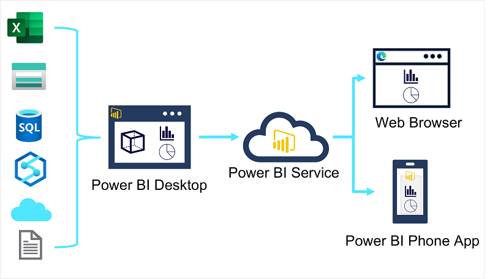

## [Intro](https://learn.microsoft.com/en-us/training/modules/explore-fundamentals-data-visualization/1-introduction)
- Data Modeling and Viz is at the heart of Business Intelligence
- Powers reporting and decision making that helps organizations succeed
- Fundamental principles of analytical data modeling and visualization, using Power BI as a platform to explore these principles in action

## [Power BI tools and workflow](https://learn.microsoft.com/en-us/training/modules/explore-fundamentals-data-visualization/2-power-bi)
- For enterprise-scale business analytics, an integrated solution that can support complex data modeling, interactive reporting, and secure sharing is required

- Microsoft Power BI
    - Suite of tools and services that data analysts can use to build interactive data visualizations for business users to consume

- Power BI Desktop 
    - Microsoft Windows application in which you can import data from a wide range of data sources
    - combine and organize data from these sources in an analytics data model
    - create reports that contain interactive visualizations of the data
- Power BI Service
    - Cloud Service in which reports can be published and interacted with by business users. You can also do some basic data modeling and report editing directly in the service using a web browser
    = Functionality is limited compared to Power BI Desktop tool
    - Use the service to schedule refreshes of the data sources on which your reports are based, and to share reports with others
    - Define dashboards and apps that combine related reports in a single easy to consume location

## [Core Concepts of Data Modeling](https://learn.microsoft.com/en-us/training/modules/explore-fundamentals-data-visualization/3-data-modeling)
- Analytical Models
    - Structure data to support analytics
    - Models are based on related tables of data, and define the numeric values that you want to analyze ore report (measures), and entities by which you want to aggregate them (dimensions)
    - Model might include a table, containing numeric measures for sales (such as revenue or quantity) and dimensions for products, customers, and time.
        - Enables you to aggregate the sale measures across one ore more dimensions. i.e. Identify total revenue by customer, or total items sold by product per month
    - Conceptually, the model forms a multidimensional structure which is commonly referred to as a cube, in any which point the dimensions intersect represents an aggregated measure for those dimensions
    - Although we refer to an analytical model as a cube, there can be more, or fewer, than three dimensions. 

- Tables and Schema
    - Dimension tables represent the entities by which you want to aggregate numeric measures - for example product or customer
    - Each entity is represented by a row with a unique key value
    - Remaining columns represent attributes of an entity.
    - Common in most analytical models to include a Time dimension so you can aggregate numeric measures associated with events over time.
    - Star Schema
        - Numeric measures which will be aggregated in various dimensions are stored in Fact tables. 
        - Each row in a fact table represents a recorded event
        - Fact table is related to one or more dimensions
    - Snowflake Schema 
        - Dimension tables are related to additional tables containing more details

- Attribute Hierarchies
    - Hierarchies enable you to drill up or drill down to find aggregated values at different levels in a hierarchical dimension
    

- Analytical Modeling in Microsoft Power BI
    - Can use Power BI to define an analytical model from tables of data, which can be imported from one or more data source
    - Then can use the data modeling interface on the Model tab of Power BI Desktop to define your analytical model by creating relationships between fact and dimension tables, defining hierarchies, setting data types and display formats for fields in the tables, and managing other properties of your data.

## [Considerations for Data Visualization]()